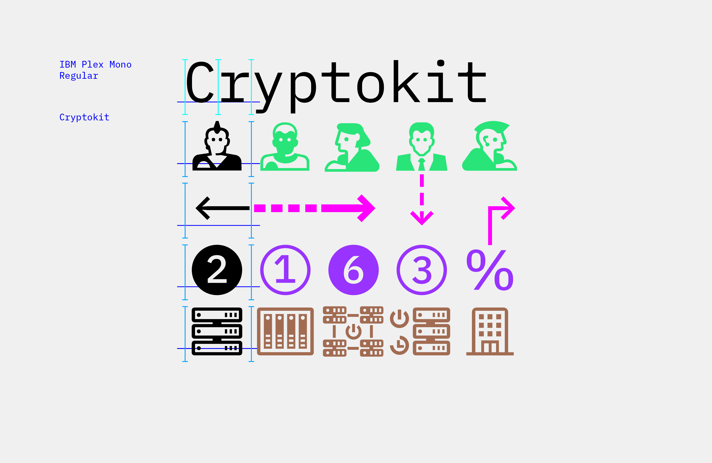
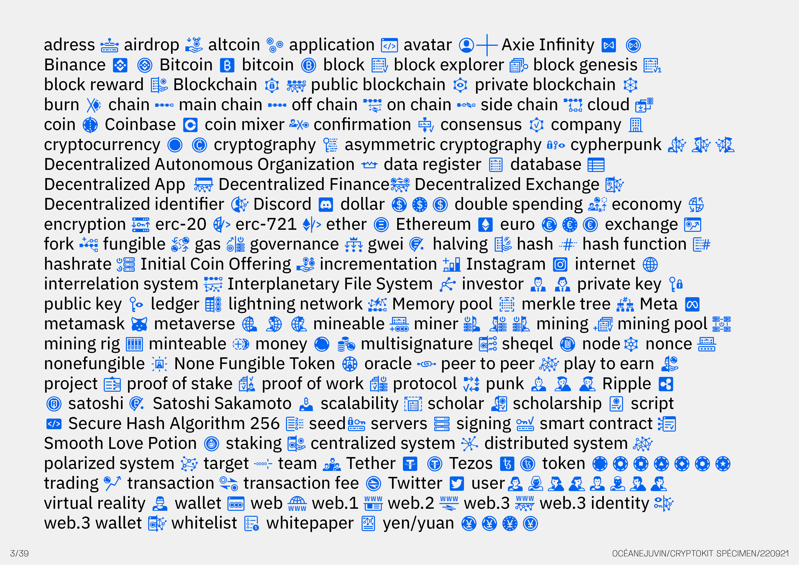
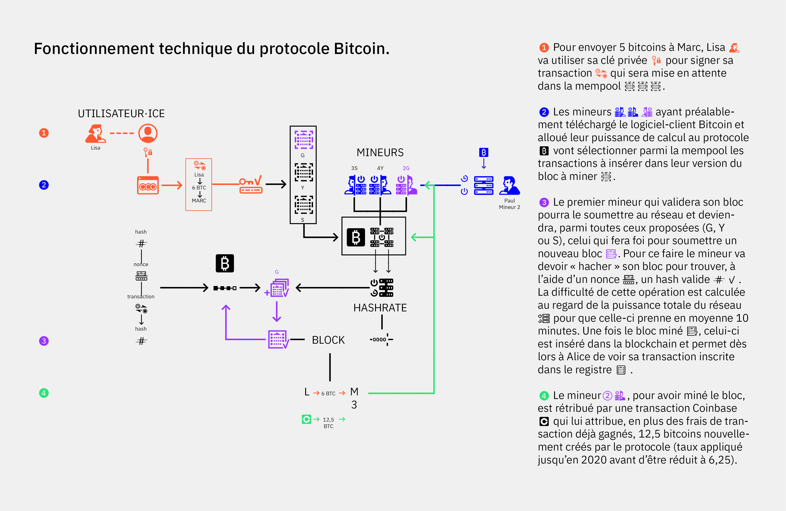

# CryptoKit

[CryptoKit] is a monospace font of pictograms conceived to explain blockchain technologies and web3 ecosystem. The drawing is based on the IBM Plex family. 

Type Design: Océane Juvin

SIL Open Font License (OFL)

Part of a research project led by Anthony Masure at HEAD – Genève and funded by HES-SO Genève. Team: Guillaume Helleu, Océane Juvin, Chloé Michel, E+K (Élise Gay and Kévin Donnot). 

Website: www.cryptokit.ch

## Specimen

## License

This Font Software is licensed under the SIL Open Font License, Version 1.1.
This license is copied below, and is also available with a FAQ at
http://scripts.sil.org/OFL

## Repository Layout

This font repository structure is inspired by [Unified Font Repository v0.3](https://github.com/unified-font-repository/Unified-Font-Repository).
